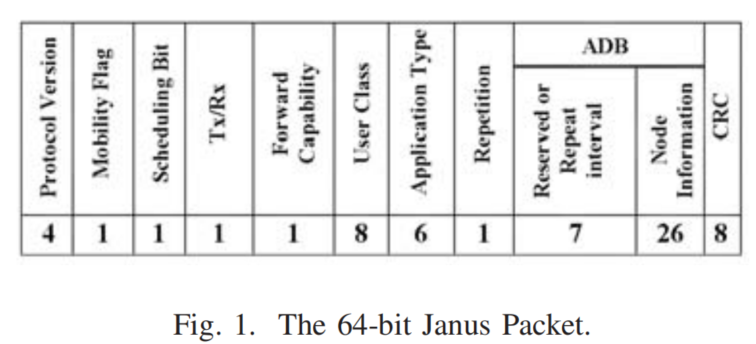
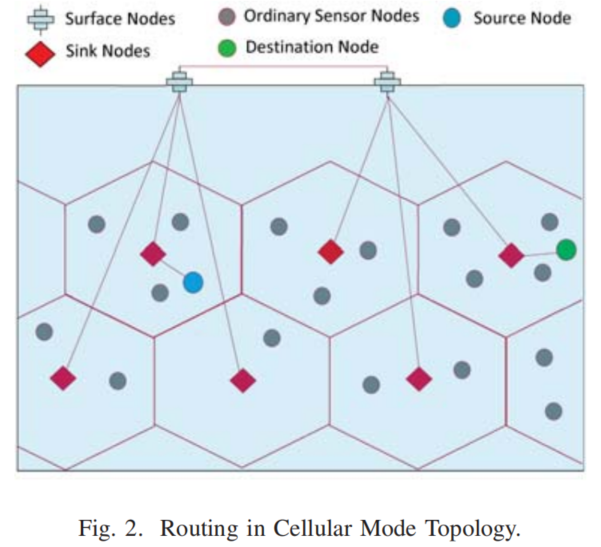
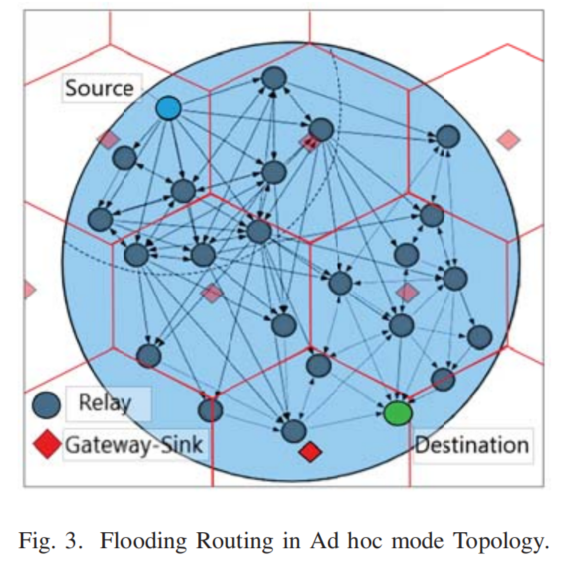
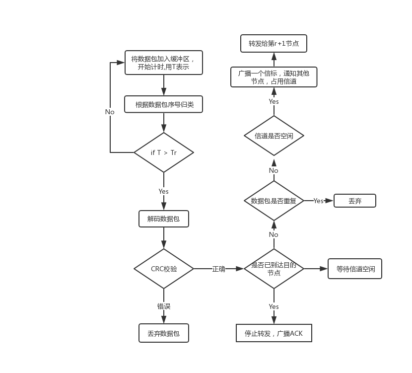
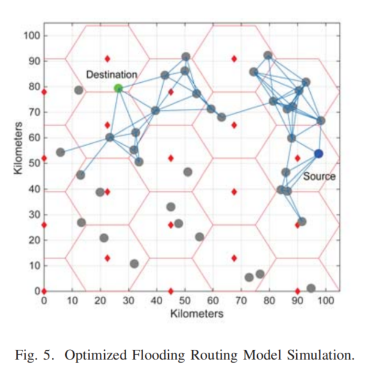

<i>H. Ghannadrezaii and J. Bousquet, "Securing a Janus-Based Flooding Routing Protocol for Underwater Acoustic Networks," OCEANS 2018 MTS/IEEE Charleston, Charleston, SC, 2018, pp. 1-7.
</i>

# 1.Janus标准

### 概括

Janus是第一个全球水声网络标准（UWAN），开发一种标准化的协议，可以使用多跳中继在异构节点之间进行通信和分组转发。该协议允许在远程水下节点之间转发短消息。例如，潜艇、自主水下航行器(AUV)、sink节点和水面舰艇的通信。

### 原理

将二进制数据转换成声波，在水下传送。十三个正交音调被映射为均匀间隔的音调对，它们跨越声学频率带宽，名义上是中心频率的三分之一。还定义了一个由32片芯片组成的固定前导序列，用于检测和同步。

### 数据包结构

大小为64bit ，由 34bit的应用数据块(ADB), 22bit的控制信息位以及8bit的CRC校验位组成。 

其中，ADB又由8bit的信道保留位和26bit有效数据位组成

------

# 2.传统协议

为了部署多用户网络，必须定义**<u>信道接入和路由协议</u>**，以满足水声(UWA)信道条件和通信要求。

- > 信道感知路由协议(CARP)，其中控制分组被用于保留信道和携带节点位置信息。此信息可用于选择sink最近的下一跳邻居转发。

- > EFlood是一种广播协议，其中一个节点立即重新发送接收到的数据包，除非它是重复的。节点在转发数据包之前等待随机持续时间。这个随机时间取决于网络拓扑和数据包传输延迟。

|        | 端到端时延 | 传输能耗  |
| ------ | ---------- | --------- |
| CARP   | 37秒       | 0.03 J/b  |
| EFlood | 9秒        | 0.049 J/b |

**在紧急任务应用中，使用多播泛洪协议是合理的，以减轻分组丢失和延迟，然而，采用多跳转发节点的分布式体系结构使得网络更容易受到安全威胁，当转发节点有权访问数据包有效载荷时，情况尤其如此。这给水下通信的发展带来了一个障碍和安全问题。**

------

# 3.本文的贡献

- 对混合网络体系结构的描述，该体系结构使用蜂窝拓扑作为主模式，并在网关sink节点未响应时，切换到ad-hoc模式。
- 提出了一种优化的泛洪路由协议，通过调整网络的重传次数来限制负载，从而提高PDR和降低整体能耗。
- 仿真了一种轻量级密钥交换协议，用于在源节点和目标节点之间建立对称密钥加密，以最小化窃听和数据篡改的风险。

### 论文的结构

Section 2: 描述了混合网络模型，蜂窝模型/ad-hoc模型及其媒体接入机制

Section 3: 提出了一种在分布式ad-hoc模式下分组转发的优化路由协议算法。

Section 4: 对网络模型进行安全加固

Section 5: 仿真数据结果

Section6: 结论

# 4.网络结构描述

### 混合网络模型

- 网络规模：100*100Km

- 三种节点类型：1. *移动的AUV或者固定的UWA传感器*、

  ​						   2. *位于水面下且部署在每个蜂窝中的网关-sink节点*

  ​					       3. *水面站点*															

#### 蜂窝模式——主模式

发送节点在经过T~L~后仍未听到接收器节点的回应数据包，则开启==ad hoc模式==。

#### ad hoc模式

发送节点广播给它的邻居一个ad hoc信号来启动ad hoc模式，并且还通过对其邻居的“沉默”请求来预留信道，在这种情况下，源节点将其数据包在MAC层封装成帧时，会在数据包的首部中设置一个泛洪路由指示符。

### 双模式下的媒体访问控制(MAC层)

*使用载波侦听多路访问与冲突避免（CSMA-CA）保持低冲突率*

- **蜂窝模式下的媒体访问控制**

  当sink节点可用时，采用蜂窝模式，选择基于时隙的Aloha来避免碰撞。

- **ad hoc模式下的访问控制**

  在ad hoc模式下，为了访问媒体，UWA节点选择具有CSMA-CA机制的无时隙aloha,来避免碰撞。

### 物理层介绍

​       在物理层，Janus标准描述了跳频二进制频移键控(FH/BFSK)调制。FH/BFSK以其在恶劣水声传播中的鲁棒性而闻名。 

# 5.优化泛洪路由算法（针对ad hoc模式）

**UWAN中路由算法设计的主要挑战是获得低的端到端延迟、低的每比特能耗和高的PDR。**

为实现ad hoc模式下的泛洪路由，设计了一个24bit的首部，加入到Janus协议数据包的用户自定义字段中。

| 8bit     | 8bit       | 5bit           | 3bit     |
| :------- | ---------- | -------------- | -------- |
| 源节点id | 目的节点id | 序号，最大(32) | 跳数H~r~ |

- 源节点id在转发过程中会改变，而目的节点id不会改变。
- 序号表示一段连续的数据分片发送时的编号，每到31重置一次。
- H~r~的大小取决于发送节点和下一跳之间的距离以及发送节点的最大传输半径
- 每个节点维持有一个与其他节点的距离表，距离表每T~D~更新一次，T~D~取决于AUV的移动速度。

### 节点r转发算法描述

用r表示转发节点，r-1表示上一个转发节点，r+1表示下一跳。

其中T~r~ = R~T~/v, 其中，R~T~代表最大传输半径，v表示声速。

### 节点r-1的超时重传算法描述

对于r-1节点，在发送一个数据包后，开始计时，如果在2((n+1)-i) (R~T~/v)秒内收到了下一跳r节点的ACK，则从自己的缓冲区中删除刚才发送的数据包。否则，超时重传。==最多重传三次==

# 6.安全加固

#### 水下无线传感器网络存在的威胁

- 窃听
- 路由攻击
- 数据篡改

加固思路：采用椭圆曲线在不安全信道上共享密钥，然后利用共享密钥，采用AES加密数据，其具体原理因为涉及到大量密码学知识，不做详细论述。

### 不足之处

当源节点想要和目的节点通信时，首先需要共享密钥，这个阶段会增加一定的网络负载。

采用128bit的key进行AES加密，如果消息长度不足128bit，则需要填充0，这也会造成额外的网络负载。

# 7.仿真结果

|          | 转发次数 | 转发节点数 |
| -------- | -------- | ---------- |
| 传统泛洪 | 100      | 37         |
| 优化泛洪 | 71       | 28         |

本文提出的算法相比于传统算法，转发次数少了29%，而参与转发的节点数量，少了24%。因此，确实更节能。

#### 安全加固模块仿真结果

对于所描述的域参数，采用IntelCorei5M520(2.4GHz)处理器的计算机，可以在500ms内计算公私钥对，这将导致源和目标都增加一秒的延迟。为了时水下网络更加安全，多一秒的延迟以及牺牲部分流量可以接受的。
